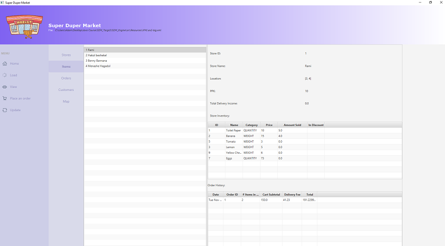

# SDM_Targil2

<h2>Tools Used</h2>
* Java
* JavaFX

<h2>How to Use</h2>
Load one of the XML files under the `resources` directory, or create your own (must match XML schema). 
Then you can simulate placing an order, viewing system information, or updating store inventories. 

<h2>Screenshots</h2>

